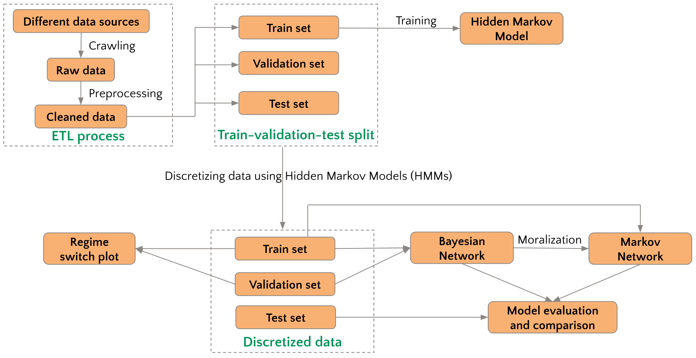

# WQU Capstone project: BTC price prediction with PGM for swing trading

## 1. Motivation

The objective of this project is to develop and compare predictive models for Bitcoin (BTC) price using two types of Probabilistic Graphical Models (PGMs): Bayesian Networks and Markov Networks. By leveraging the power of these PGMs, we aim to identify the key sentiment, financial, technical, and on-chain factors that significantly influence the price of BTC. We then construct and compare models using both Bayesian and Markov network. This comparative analysis will provide valuable insights for swing traders looking to make informed trading decisions based on our assessment of these predictive models.

The project encompasses the following goals:

- **Factor Identification**: We will carefully analyze a diverse set of sentiment, financial, technical, and on-chain metrics to identify the most influential factors affecting the price of BTC. To understand these factors, we can gain deeper insights into the market dynamics.
- **PGM Construction**: Using the identified factors, we will construct a sophisticated Probabilistic Graphical Model. This model will capture the complex relationships and dependencies among the factors, allowing us to predict accurately future BTC price movements.
- **Markov model Construction**: As a comparative study, we will also construct a Markov Network, to investigate the potential differences and performance of both modeling approaches in the context of cryptocurrency price prediction.
- **Performance Comparison**: We will evaluate the prediction accuracy of both models using Mean Absolute Error (MAE). Further, we will measure trading performance using metrics such as return on investment and Sharpe ratio. By contrasting the outcomes, we aim to showcase the viability of our predictive models.

By achieving these objectives, we seek to provide traders and investors with a valuable tool for making informed decisions in the dynamic and volatile world of cryptocurrency trading.

## 2. Data

The dataset can be accessible in [./historical_data](./historical_data/), including:

- [Financial Data](./historical_data/financial_data.csv): This includes data from the S&P500, Gold, 13-Week Treasury, and the USD Index. We sourced our financial data from Yahoo Finance.
- [On-chain Data](./historical_data/btc_onchain_data.csv): We included various on-chain variables such as hash rate, block difficulty, and transaction count. To acquire this data, we utilized the Coin Metrics API v4.
- [Sẹntiment Data](./historical_data/google_trend.csv): To gauge the sentiment surrounding Bitcoin, we utilized Google Trends data, specifically focusing on the word count associated with Bitcoin. The data collection for this category was done using the Google Trends Python API.
- [Bitcoin Market Data](./historical_data/btc_ohlcv.csv): This category encompasses Bitcoin candle and volume data. These indicators provide valuable insights into different dimensions of price momentum, trend analysis, volatility, and volume dynamics.
- [Technical Indicators](./preprocessed_data/preprocessed_data.csv): We included a variety of technical indicators such as RSI, MACD, and Bollinger Bands. These indicators provide valuable insights into different dimensions of price momentum, trend analysis, volatility, and volume dynamics.

## 3. The workflow



## 4. Project Setup & Execution

### 1. Creating a Virtual Environment
While there are several ways to set up a Python virtual environment for this project, we recommend using conda, a powerful package manager and environment manager from Anaconda. Conda makes it easy to create, save, load, and switch between project environments, and it can handle packages from Python and other languages as well. Alternatively, you can also use venv, a module provided by Python itself to create virtual environments. Please note you may require additional setup if you use venv.

**Recommended Method: Using conda**
- Download and install `conda` by downloading the Anaconda distribution from [here](https://www.anaconda.com/download).
- Create a virtual environment dedicated to this project by running the following commands using Anaconda Prompt:
```bash
conda create -n wqu_env python=3.9
conda activate wqu_env
```

**Alternative Method: Using venv**

If you prefer not to use conda, you can create a virtual environment using venv. To do this, navigate to the directory where you want to place the virtual environment, then run the venv module as a script:

1. Create environment
```bash
python3 -m venv wqu_env
        or 
python -m venv wqu_env
```

2. Activate environment

For **Unix or MacOS**:
```bash
source wqu_env/bin/activate
```

For **Windows** users using Git Bash:
```bash
source wqu_env/Scripts/activate
```

### 2. Clone the repository and install requirements
- Clone this repository:

```bash
git clone https://github.com/honghanhh/wqu_capstone_project_3621.git
cd wqu_capstone_project_3621
```

- Run the following command to install the required packages:

```bash
pip install -r requirements.txt
```

- Install the hmms package:
```bash
pip install hmms git+https://github.com/lopatovsky/HMMs.git@c7ef1a72d49de388ed62632137566586cd06812c
```

Note: 
- We install hmms separately to ensure that its dependencies, such as Numpy and Cython, are correctly installed first. This order of installation helps prevent any potential errors linked to missing or incorrectly installed dependencies.
- We recommend using Conda for installation. If you choose not to use Conda, be aware that you'll need to set up the necessary C++ build tools to compile the hmms package. This is because hmms has components written in C++ and it needs a C++ compiler to be installed on the system.

### 3. Run the pipeline
- Run the following command to compile end-to-end pipeline:

```python
chmod +x run.sh
./run.sh
```

**Note (Windows users)**: We recommend using Git Bash to run the run.sh script, as Windows Command Prompt and PowerShell do not support the running of bash scripts without additional setup.

If you want to run each step of the pipeline separately, run each of the command in the `run.sh` file.

## Contributors

- 🐮 [Hanh Tran](https://github.com/honghanhh) 🐮
- 🦁 [Moaz Razi ](https://github.com/moazrazi) 🦁
- [Phat Nguyen](https://github.com/fattiekakes)
